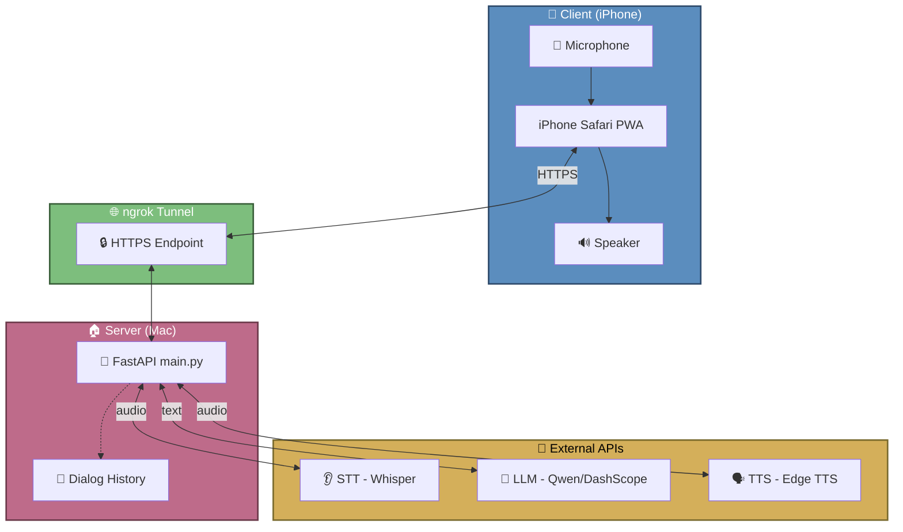

# 🏗️ ParkPartner

```mermaid
flowchart
    subgraph Client["📱 Client (iPhone)"]
        Mic[🎤 Microphone]
        Browser[iPhone Safari PWA]
        Speaker[🔊 Speaker]
    end

    subgraph Tunnel["🌐 ngrok Tunnel"]
        HTTPS[🔒 HTTPS Endpoint]
    end

    subgraph Server["🏠 Server (Mac)"]
        API[🐍 FastAPI main.py]
        History[💾 Dialog History]
    end

    subgraph External["🔌 External APIs"]
        Whisper[👂 STT - Whisper]
        LLM[🧠 LLM - Qwen/DashScope]
        TTS[🗣️ TTS - Edge TTS]
    end

    Mic --> Browser
    Browser <-->|HTTPS| HTTPS
    HTTPS <--> API
    API -.-> History
    API <-->|audio| Whisper
    API <-->|text| LLM
    API <-->|audio| TTS
    Browser --> Speaker

    style Client fill:#5B8DBE,stroke:#2E4A6B,stroke-width:2px,color:#FFFFFF
    style Tunnel fill:#7DBE7D,stroke:#3A5F3A,stroke-width:2px,color:#FFFFFF
    style Server fill:#BE6B8A,stroke:#6B3A4A,stroke-width:2px,color:#FFFFFF
    style External fill:#D4AF5A,stroke:#7A6B2E,stroke-width:2px,color:#000000
```
