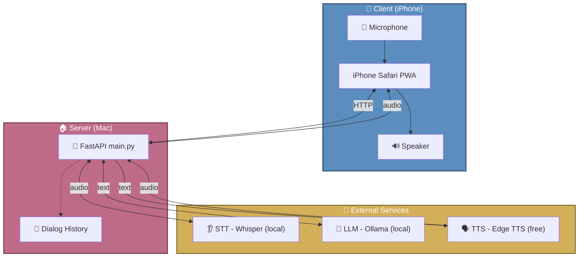

# 🏗️ ParkPartner Architecture

## Overview

ParkPartner follows a **hexagonal architecture** (ports and adapters) pattern, separating core business logic from external concerns like APIs, databases, and third-party services.

## System Architecture



## Data Flow

1. **User speaks** → iPhone microphone captures audio
2. **Browser sends** → Audio (WebM) sent via HTTP POST to `/process`
3. **Server processes:**
   - **STT**: Audio → Whisper → Text
   - **LLM**: Text → Ollama → Response Text
   - **TTS**: Response Text → Edge TTS → Audio (MP3)
4. **Server returns** → MP3 audio file
5. **Browser plays** → Audio played through iPhone speaker

## Project Structure

```
parkpartner/
├── main.py                 # FastAPI application entry point
├── app/
│   ├── adapters/           # External service implementations
│   │   ├── api/            # HTTP API routes
│   │   ├── llm/            # Ollama LLM adapter
│   │   ├── stt/            # Whisper STT adapter
│   │   └── tts/            # Edge TTS adapter
│   ├── core/               # Application core
│   │   ├── dependencies.py # Dependency container
│   │   └── state.py        # Global state management
│   ├── domain/             # Business logic layer
│   │   ├── ports.py        # Interface definitions (protocols)
│   │   └── service.py      # Core conversation logic
│   └── config.py           # Configuration management
├── static/                 # Frontend assets
│   └── index.html          # Single-page PWA interface
├── tests/                  # Unit tests
│   ├── test_adapters.py
│   ├── test_routes.py
│   └── test_service.py
└── docs/
    └── architecture.md     # This file
```

## Component Details

### Domain Layer (`app/domain/`)

The domain layer contains the core business logic and is independent of external frameworks.

- **`service.py`** - `process_conversation()` function orchestrates the full pipeline:
  1. Transcribe audio with Whisper
  2. Build conversation history
  3. Generate response with LLM
  4. Synthesize speech with Edge TTS

- **`ports.py`** - Defines interfaces (protocols) for adapters:
  - `STTPort` - Speech-to-text interface
  - `LLMPort` - Language model interface
  - `TTSPort` - Text-to-speech interface

### Adapters Layer (`app/adapters/`)

Adapters implement the domain ports and handle external service communication.

| Adapter | File | Protocol | Description |
|---------|------|----------|-------------|
| **STT** | `stt/whisper.py` | Audio → Text | Local Whisper model transcription |
| **LLM** | `llm/ollama.py` | Text → Text | Ollama API chat completion |
| **TTS** | `tts/edge.py` | Text → Audio | Edge TTS neural voice synthesis |
| **API** | `api/routes.py` | HTTP → Response | FastAPI REST endpoints |

### Core Layer (`app/core/`)

Application-specific concerns that don't belong to domain or adapters.

- **`dependencies.py`** - `Dependencies` dataclass for adapter injection
- **`state.py`** - Global state (session histories, Whisper model, locks)

### Configuration (`app/config.py`)

Environment-based configuration with sensible defaults:

```python
# STT
WHISPER_MODEL = "small"
WHISPER_LANGUAGE = "ru"
STT_TIMEOUT = 60

# LLM
OLLAMA_BASE_URL = "http://localhost:11434"
OLLAMA_MODEL = "qwen2.5:3b"
LLM_TEMPERATURE = 0.7
LLM_MAX_TOKENS = 150

# TTS
TTS_VOICE = "ru-RU-DmitryNeural"
TTS_TIMEOUT = 20

# Conversation
SYSTEM_PROMPT = "Ты дружелюбный помощник для прогулок в парке..."
MAX_HISTORY_MESSAGES = 6
```

## Technology Decisions

### Why Local Whisper?
- ✅ No API costs
- ✅ Privacy (audio never leaves the machine)
- ✅ Offline capable
- ❌ Requires GPU for fast inference

### Why Ollama?
- ✅ Local LLM hosting
- ✅ Easy model management
- ✅ OpenAI-compatible API
- ❌ Requires manual model downloads

### Why Edge TTS?
- ✅ Free (no API key required)
- ✅ High-quality neural voices
- ✅ No rate limits
- ❌ Requires internet connection

### Why FastAPI?
- ✅ Async support for concurrent requests
- ✅ Automatic OpenAPI documentation
- ✅ Type validation with Pydantic
- ✅ Easy testing with TestClient

## Security Considerations

| Concern | Current State | Recommendation |
|---------|---------------|----------------|
| **CORS** | `allow_origins=["*"]` | Restrict to specific domains in production |
| **File Upload** | 10MB limit | Adequate for voice recordings |
| **Session Management** | Single "anonymous" session | Add user authentication for multi-user |
| **Audio Storage** | Temporary files, auto-deleted | No persistent storage (privacy+) |

## Performance Characteristics

| Operation | Typical Latency | Notes |
|-----------|-----------------|-------|
| **STT (Whisper small)** | 2-5 seconds | Depends on audio length |
| **LLM (qwen2.5:3b)** | 1-3 seconds | Depends on response length |
| **TTS (Edge)** | 1-2 seconds | Network-dependent |
| **Total Pipeline** | 4-10 seconds | End-to-end response time |

## Testing Strategy

- **Unit Tests** (`tests/`) - Mock external services, test business logic
- **Integration Tests** - Future: Test full pipeline with real services
- **E2E Tests** - Future: Browser automation with Playwright

## Future Improvements

1. **Session Management** - Add user authentication and isolated conversations
2. **Streaming** - Stream audio chunks for lower latency
3. **Caching** - Cache common responses for faster replies
4. **Multi-language** - Support multiple languages via config
5. **Voice Activity Detection** - Auto-detect speech start/end
